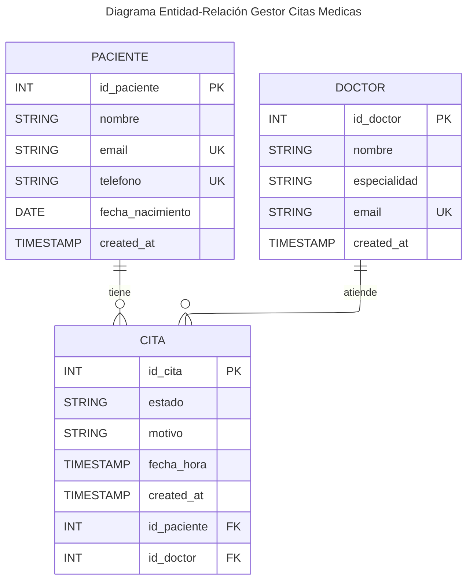

# Especificaciones sobre el Stack tecnológico y el estilo arquitectónico

## Stack

__Frontend:__ Vue

__Backend:__ Golang/echo

__Protocolo de integración:__ Graphql

__DBMS:__ Postgre

__Estilo:__ Clean architecture

---

## Alcance del Caso Práctico (Sistema de Citas Médicas)

### Descripción general

La solución consiste en el desarrollo de un gestor de citas médicas, permitiendo administrar pacientes, doctores y la programación de citas entre ambos.

---

### 1. Modelado

Se definen tres entidades principales:

- Paciente
- Doctor
- Cita

__Relaciones:__
- Un Paciente puede tener múltiples Citas
- Un Doctor puede tener múltiples Citas
- Una Cita pertenece a un único Paciente y a un único Doctor

> [!NOTE]
> Esto genera una relación muchos a muchos entre Paciente y Doctor, resuelta mediante la entidad Cita.

#### ERD (Diagrama Entidad-Relación en Mermaid)

---

### 2. Flujo Funcional (end-to-end)

Caso de uso completo:
1. Registrar paciente
2. Registrar doctor
3. Agendar cita médica
4. Consultar citas por paciente
5. Consultar citas por doctor
6. Actualizar estado de la cita (pendiente, atendida, cancelada)
7. Cancelar cita

---

### 3. Persistencia

La persistencia se gestiona mediante PostgreSQL, utilizando una base de datos relacional que permite garantizar la integridad de las relaciones entre
pacientes, doctores y citas. Se emplea el paquete database/sql de Go junto con un driver compatible para la conexión y ejecución de consultas.

---

### 4. Robustez (TODO)
> [!IMPORTANT]
> hacer esta sección

---

### 5. Justificación Técnica (TODO)
> [!IMPORTANT]
> hacer este sección

